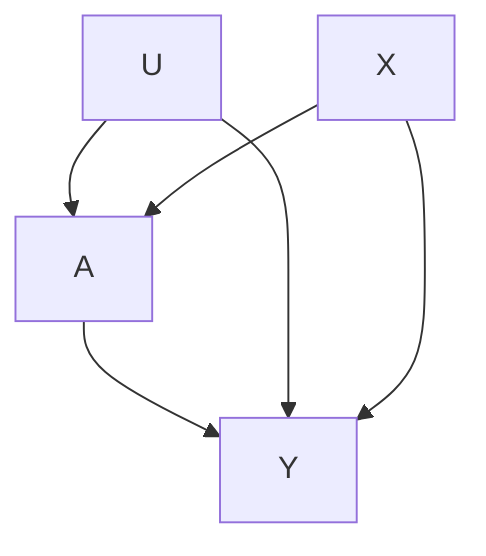
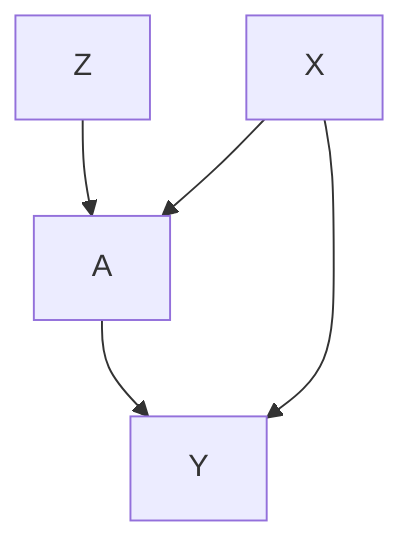

# Flow Diagrams

## Instrumental Variables

```mermaid
     flowchart TD;
        A --> Y;
        U --> A;
        U --> Y;
        X --> A;
        X --> Y;
```

```mermaid
     flowchart TD;
        A --> Y;
        Z --> A;
        X --> A;
        X --> Y;
```