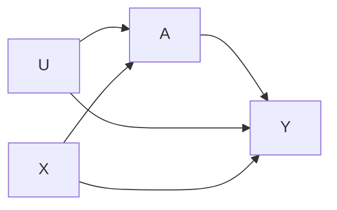
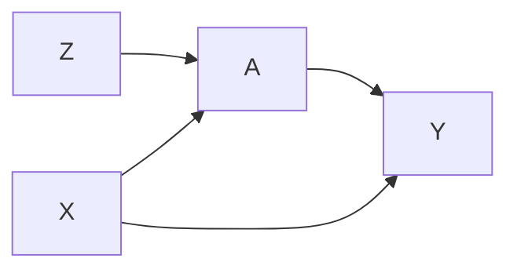

# Flow Diagrams

## Instrumental Variables

- Unmeasured Confounders `U`
- Measured Confounders `X`
- Treament `A`
- Outcome  `Y`

- Instrumental Variable `Z`
- Measured Confounders `X`
- Treament `A`
- Outcome  `Y`

